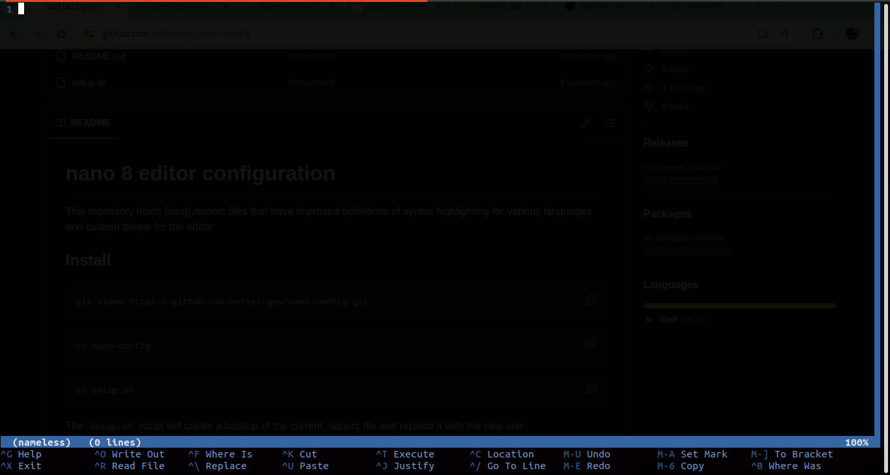

# nano 8 editor configuration

This repository holds {lang}.nanorc files that have improved definitions of syntax highlighting for various languages and custom theme for the editor.

## Install

```bash
git clone https://github.com/nottechguy/nano-config.git
```
```bash
cd nano-config
```

```bash
sh setup.sh
```

The `setup.sh` script will create a backup of the current .nanorc file and  replace it with the new one.

Reopen the terminal in order to see the new changes.

This is the result



See more about the tweaks that can be done to the editor [here](https://www.nano-editor.org/dist/latest/nanorc.5.html)